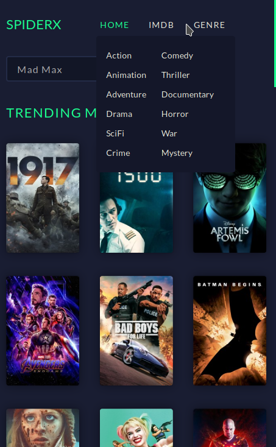

# SpiderX
SpiderX allows you to watch movies by scraping data from the internet. The frontend is built with Vue.js and the scraping process is handled by python scrapy framework.

## How it works
1. The user searches will be first sent to firestore, if the search is not found in the firestore then the scraper (using python scrapy framework) will be called to initiate the scraping process.
2. Once the scraper scrapes the data, the data scraped will be sent to firestore.
3. Using firestore real-time updates, the vue interface will be updated in real-time.

## Running locally

1. You need to setup firestore and initialize the db in src/firebase.js

```javascript
import firebase from 'firebase/app';
import 'firebase/firestore';

// fill the values you get from firestore
const config = {
  apiKey: '<apiKey>',
  authDomain: '<authDomain>',
  databaseURL: '<databaseURL>',
  projectId: '<projectId>',
  storageBucket: '<storageBucket>',
  messagingSenderId: '<messagingSenderId>',
  appId: '<appId>',
  measurementId: '<measurementId>',
}

firebase.initializeApp(config);

const db = firebase.firestore();

export default db;
```

2. You need to configure .env at the root of the project

```javascript
VUE_APP_SPIDERX_HEROKU=<URLHERE> // the python scraper will be up soon 
```

3. Then run <code>npm i && npm run serve</code> to see the spider in action

## UI


# Mobile Layout

